# Two Pieces

## Visão Geral

Two Pieces é um aplicativo de jogo mobile inspirado no universo de One Piece. Nele, os usuários podem criar seus próprios personagens e enfrentar icônicos personagens do anime em um sistema de combate por turnos. A cada vitória, o jogador pode subir de nível e melhorar os atributos de seu personagem.

Além da jogabilidade, o aplicativo oferece três catálogos detalhados para o usuário acompanhar seu progresso no mundo de One Piece:

* **Catálogo de Personagens**: Lista de informações sobre todos os personagens que o usuário já derrotou em combate.
* **Catálogo de Akuma no Mi**: Detalhes sobre as Akuma no Mi que o usuário consumiu (frutas que concedem poderes no universo One Piece).
* **Catálogo de Tripulações**: Informações sobre as tripulações piratas que o usuário já participou.

---

## Participantes

* Lucas Lacerda Arruda
* Cassiano Carvalho de Souza

---

## Tipos de Usuários

O aplicativo possui dois tipos de usuários:

* **Usuário Não Cadastrado**: Pode visualizar apenas a tela inicial e a tela de cadastro. Não tem acesso às funcionalidades do jogo.
* **Jogador (Usuário Cadastrado)**: Possui acesso completo ao aplicativo, incluindo a criação de personagens, combates e os catálogos.
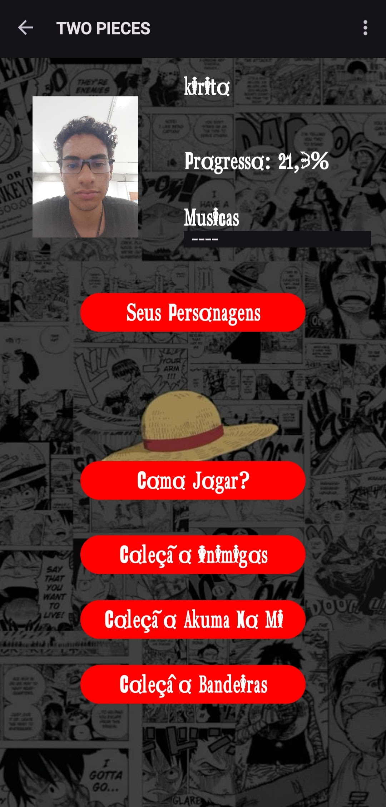

---

## Requisitos Funcionais

O aplicativo deve permitir as seguintes funcionalidades principais:

* **Como Jogar**:
    * É um tela que vai mostrar como o jogo funciona e te dar um base de como jogar.
    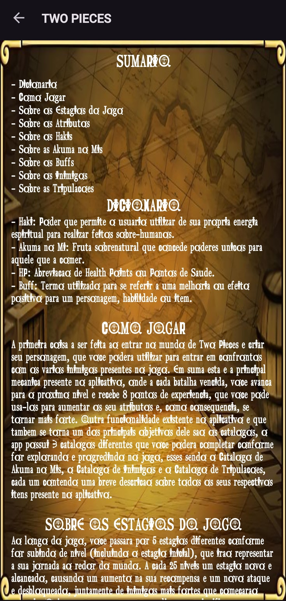

* **Gerenciamento de Usuários**:
    * Cadastro de novos usuários (nome, e-mail, senha).
    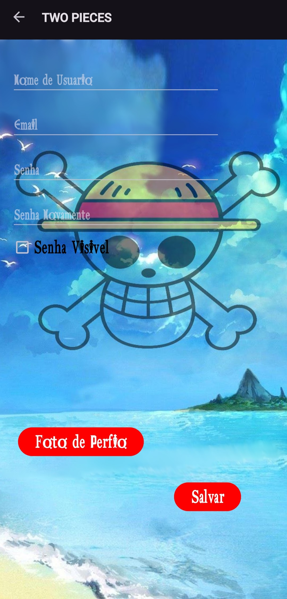
    * Modificação de dados de usuário.
    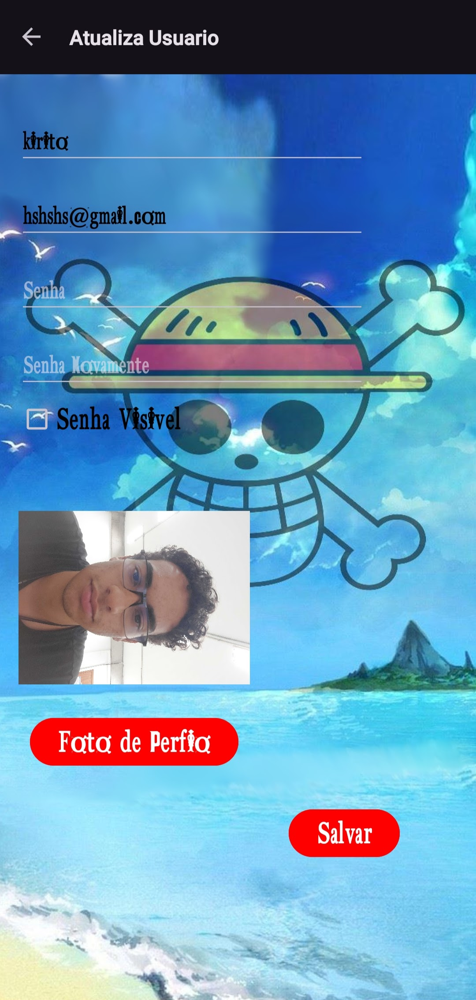
    * Exclusão de contas de usuário.
    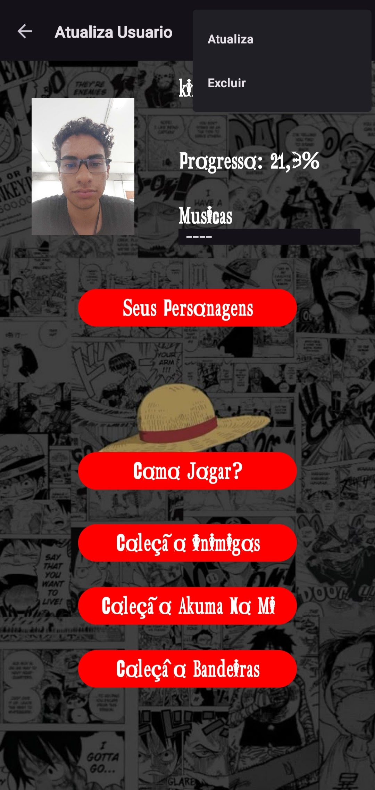
    * Validação para evitar e-mails e nomes de usuário repetidos.
    * Acesso restrito para usuários não cadastrados.

* **Gerenciamento de Personagens**:
    * Criação de personagens com atributos personalizáveis (Nome, Origem, Associação, Gênero, Arma, Raça e Akuma no Mi - todos obrigatórios).
    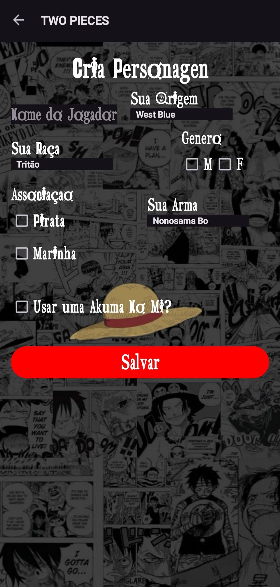
    * Modificação de atributos de personagens criados pelo usuário.
    * Exclusão de personagens.
    * Atualização de atributos do personagem após subir de nível.
    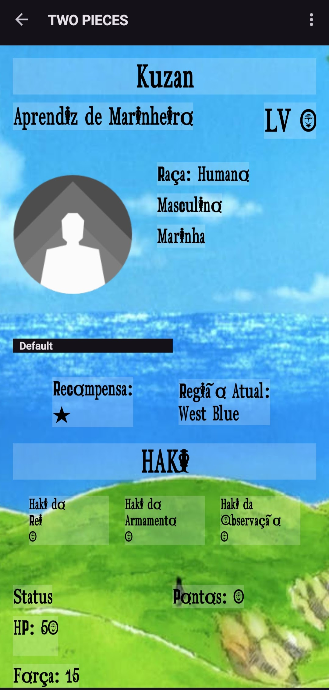
    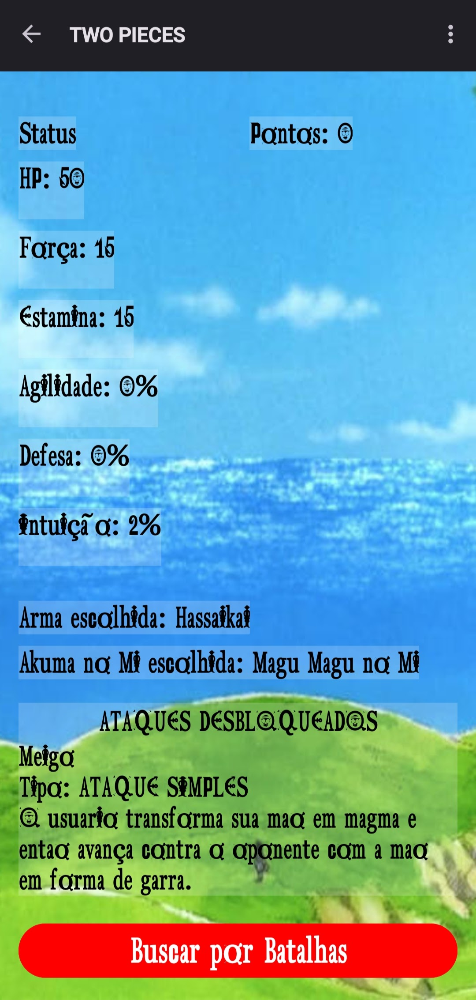

* **Sistema de Combate**:
    * Batalhas por turnos entre o personagem do usuário e personagens pré-definidos do universo One Piece (controlados pelo "Computador").
    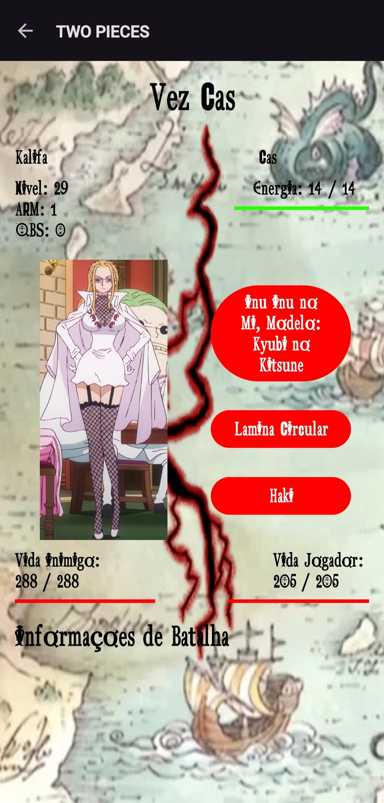
    * Cálculos internos para balanceamento do combate.

* **Catálogos**:
    * Exibição das informações nos catálogos de Personagens, Akuma no Mi e Tripulações com base no progresso do usuário.
    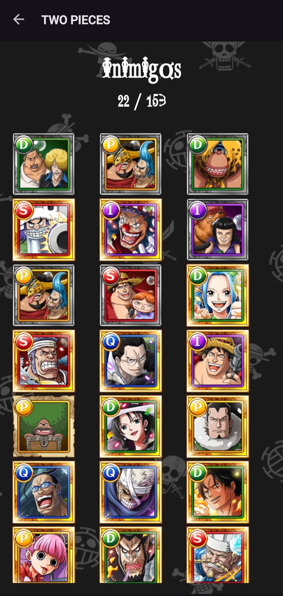
    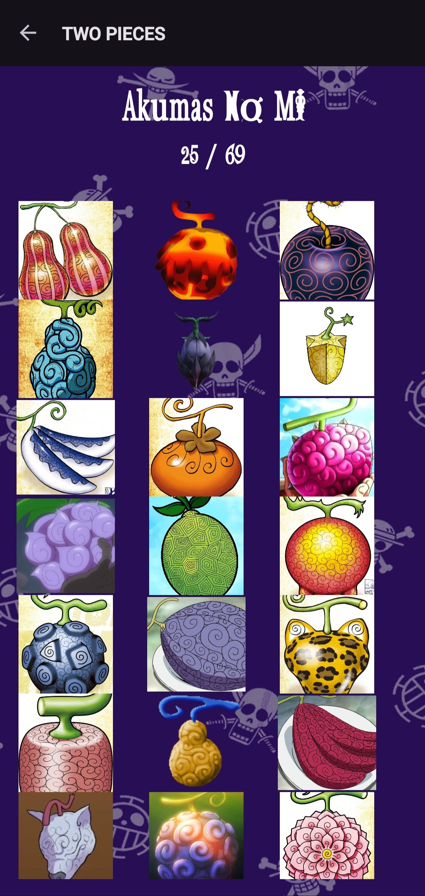
    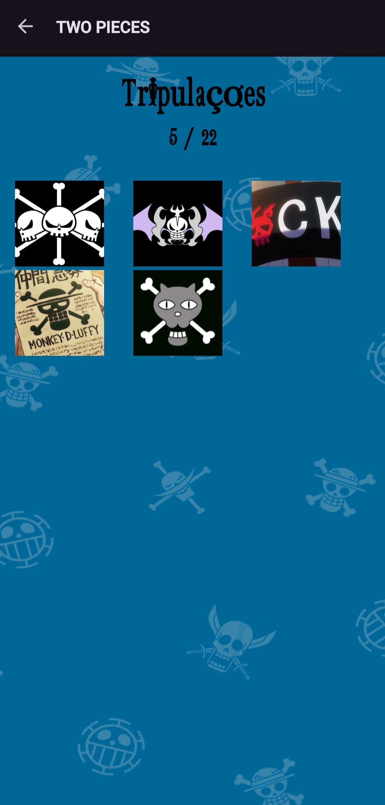

---

## Entradas Necessárias

* **Cadastro de Usuário**: Nome de usuário, e-mail e senha.
* **Criação de Personagem**: Nome, Origem, Associação, Gênero, Arma, Raça e Akuma no Mi.
* **Atualização de Status/Batalhas**: Escolha do usuário para iniciar e progredir.

---

## Processamento Realizado

O aplicativo realizará os seguintes processamentos:

* **Gerenciamento de Banco de Dados (ROOM)**: Operações de busca e inserção de dados no banco local.
* **Lógica de Combate**: Cálculos para determinar o resultado das batalhas e manter o balanceamento do jogo.

---

## Saídas e Feedback

O aplicativo fornecerá feedback ao usuário através de:

* **Toasts**: Mensagens curtas para informar sobre o sucesso ou falha em operações (ex: "Usuário criado com sucesso", "Personagem salvo").
* **Pop-ups**: Janelas informativas que mostram o progresso do usuário nas lutas.
* **Elementos Visuais e Sonoros**: Para aprimorar a experiência de combate e navegação.

## Base de Dados utilizada

* Lucas cuidou especialmente da parte de colete de dados e filtragem:
https://docs.google.com/spreadsheets/d/1vIq6X3jW3iSxkjucWKqHd8ezI8qjMQFcx231CdrX3Qs/edit?gid=0#gid=0

